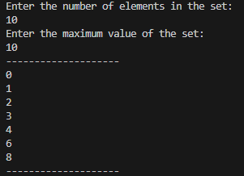
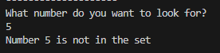
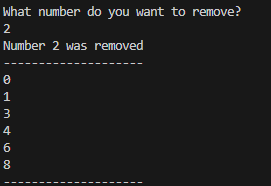
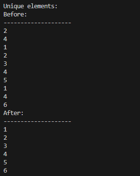

# CSC263 Create and Manipulate Sets
## Overview
This assignment will help you to put your hand on the Java Collections Framework implementation.
## Guidelines 
Using the Textbook and online resources: Create a 'HashSet' of integers.
## Expectation:
* Create a HashSet of integers.
* Add elements to the set.
* Remove elements from the set.
* Check if an element exists in the set.
* Print all elements in the set.
* Unique Elements: Write a method 'uniqueElements(int[] array)' that takes an array of integers and returns a Set containing only the unique elements from the array.
# Screenshots

